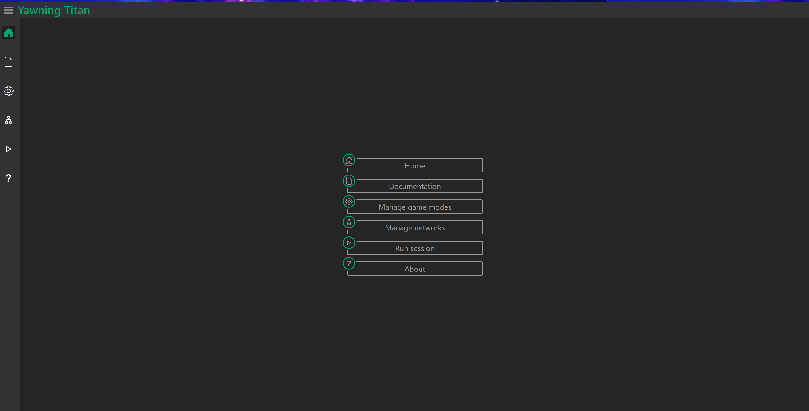

=================
Create a Network
=================

Gettting started
################

To get started, Navigate to the network manager page from the sidebar or main menu

Copying a game mode
#######################

Existing game modes can be copied by clicking the *clipboard icon* of the game mode that should be copied and entering
a name for the resultant game mode in the popup prompt.

Creating a new game mode
########################

Game modes are created from the game mode manager page.
To create a game mode click the *New game mode* button and follow the popup prompt.

Deleting a game mode
####################

Game modes can be deleted singularly or on mass. To delete a single game mode click on the *trash bin icon*.
To delete multiple networks select multiple game modes then with each of these game modes show as selected click the
*Delete all* button on the bottom right of the window and respond to the prompt.

Configuring a game mode
#######################

When a game mode is created
