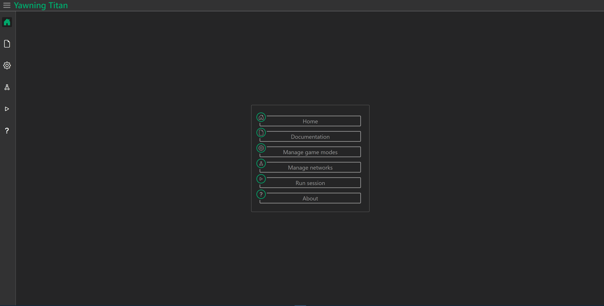

==================
Create a game mode
==================

Gettting started
################

To get started, Navigate to the game mode manager page (cog wheel icon) from the sidebar or main menu

Copying a game mode
#######################

Existing game modes can be copied by clicking the *clipboard icon* of the game mode that should be copied and entering
a name for the resultant game mode in the popup prompt.

Creating a new game mode
########################

Game modes are created from the game mode manager page.
To create a game mode click the *New game mode* button and follow the popup prompt.

Deleting a game mode
####################

Game modes can be deleted singularly or on mass. To delete a single game mode click on the *trash bin icon*.
To delete multiple networks select multiple game modes then with each of these game modes show as selected click the
*Delete all* button on the bottom right of the window and respond to the prompt.

Configuring a game mode
#######################

The game mode configuaration page allows all configurable elements of a game mode to be assigned values.
Range bound values are represented as sliders, Unbounded numeric values and free text inputs are represented as single line input fields.
Data such as the game mode name can also be edited in a seperate menu on the left side of the window.

Saving changes
**************
By default when the game mode is updated the changes will automatically be saved to the game mode in the database.

Game mode sections
******************
The configuaration page divides the game mode into seperate tabs for each of its sections. Each tab has an icon which will appear with a green outline
when the section of the game mode is valid.

Editing a specific game mode
****************************
When a game mode is created the game mode configuaration page will automatically open. Otherwise the configuaration page for a specific game mode can
be opened by clicking the *pencil icon* or *eye icon* on the game mode element. Locked game modes are uneditable and will appear on the configuaration page
with the input elements disabled and on the management page with an *eye icon* icon in place of the *pencil icon*.

Validation
**********
When value of game mode elements are updated the validation checks speicified in the :class: `~yawning_titan.game_modes.game_mode.GameMode` are executed.
The errors (if any) are then displayed as bullet points under the heading of the group or element to which they apply.
