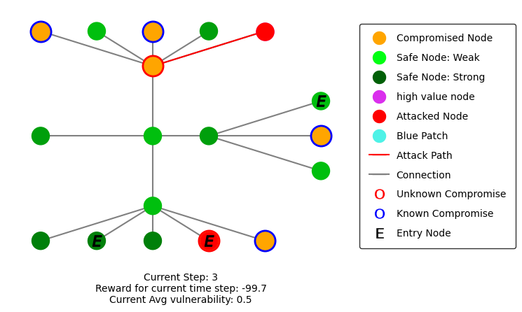

Monitoring Experiments
=======================

Mid Experiment
****************
When you create an agent you can include the verbose tag to give you updates on the training:

.. code:: python

    from stable_baselines3 import PPO
    from stable_baselines3.ppo import MlpPolicy as PPOMlp

    agent = PPO(PPOMlp, env, verbose=1)

If you are using experiment_runner.py then this will automatically be turned on.

This verbose tag will create these at set intervals during training

The update contains information such as:
 * ep_len_mean
    The average length of each game over this episode
 * ep_rew_mean
    The average reward the blue agent received over this episode
 * loss
    Indicates how bad a prediction is that a model took. A perfect prediction is zero and the bigger the loss, the bigger the negative reward incurred from the prediction

The verbose tag will also give you a brief evaluation at the end of training

If using the generic network environment there are a couple of toggles that you can use to collect more information about the training process and env:

.. code:: python

    env = GenericNetworkEnv(
        red,
        blue,
        network_interface,
        number_of_actions,
        print_metrics=True,
        show_metrics_every=10,
        collect_data=False,
    )

When creating an env you can toggle `print_metrics` to True. This will print out stats at the end of each game
showing you what actions were taken, how long the game lasted and who won.

You can also toggle `collect_data` to True. This will collect a lot of data about each action and how it has affected the
environment at each "step" of the step method. All this data will then be returned from the step method as a dictionary.

End of Experiment
*****************

If using the experiment_runner.py then after training some summary stats will be printed out as shown below.

Rendering
**********
Most of the environments in YAWNING TITAN support rendering and have a render method. This
method will create a matplotlib graph showing the current state of the environment.
Here are some images showing how the rendering looks:

Creating an ActionLoop with the environment and agent will run the agent through a game rendering each step. A tutorial on how
to do this can be found at:

    ``~/yawning_titan/notebooks/sb3/End to End Generic Env Example - Env Creation, Agent Train and Agent Rendering.ipynb``

Once the rendering is complete the entire episode will be saved as a gif so that you can watch it again at any time.

When rendering an environment it is automatically set up to show you the true state of the environment. You can, however,
set it to only show the blue agent's view of the environment. This can be toggled by passing in: ``show_only_blue_view=True``.
