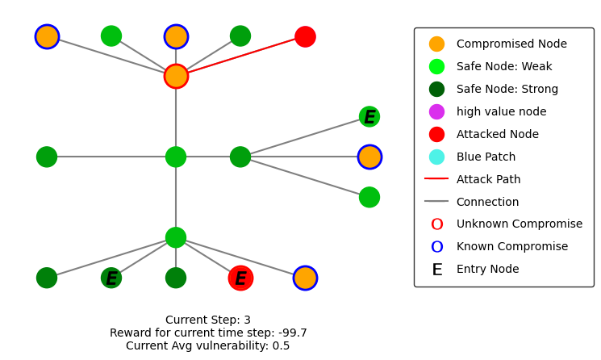

.. _getting-started:

Getting Started
===============

Pre-Requisites
**************
To get YAWNING-TITAN (**YT**) installed, you will need to have the following
installed:

* ``python3.8+``
* ``python3-pip``
* ``virtualenv``

**YT** is designed to be OS-agnostic, and thus should work on most
variations/distros of Linux, Windows, and MacOS.

Installation from source
~~~~~~~~~~~~~~~~~~~~~~~~

1. Navigate to the YAWNING-TITAN folder and create a new python :term:`Virtual Environment` (**venv**)
^^^^^^^^^^^^^^^^^^^^^^^^^^^^^^^^^^^^^^^^^^^^^^^^^^^^^^^^^^^^^^^^^^^^^^^^^^^^^^^^^^^^^^^^^^^^^^^^^^^^^^

.. code:: unix

   python3 -m venv <name_of_venv>

2. Activate the :term:`venv<Virtual Environment>`
^^^^^^^^^^^^^^^^^^^^^^^^^^^^^^^^^^^^^^^^^^^^^^^^^

**Unix**

.. code:: bash

   source <name_of_venv>/bin/activate

**Windows**

.. code:: powershell

   .\<name_of_venv>\Scripts\activate

3. Install :mod:`~yawning_titan` into the :term:`venv<Virtual Environment>` along with all of its dependencies
^^^^^^^^^^^^^^^^^^^^^^^^^^^^^^^^^^^^^^^^^^^^^^^^^^^^^^^^^^^^^^^^^^^^^^^^^^^^^^

.. code:: bash

   python3 -m pip install -e .

This will install all of the dependencies including algorithm libraries. These libraries all use ``torch``. If you’d
like to install ``tensorflow`` for use with Rllib, you can do this manually or install ``tensorflow`` as an optional
dependency by postfixing the command in step 3 above with the ``[tensorflow]`` extra. Example:

.. code:: bash

   python3 -m pip install -e .[tensorflow]

Development Installation
~~~~~~~~~~~~~~~~~~~~~~~~

To install the development dependencies, postfix the command in step 3
above with the ``[dev]`` extra. Example:

.. code:: bash

   python3 -m pip install -e .[dev]

What's required to create a **YT** :class:`~yawning_titan.envs.generic.generic_env.GenericNetworkEnv`?
***************************************************
Now that you have installed YT, it's time to create your first environment, but let's first quickly describe what's
required to create a **YT** :class:`~yawning_titan.envs.generic.generic_env.GenericNetworkEnv`. **YT** has the functionality
to create generic OpenAI ``Gym`` based network environments and requires the following to create a
:class:`~yawning_titan.envs.generic.generic_env.GenericNetworkEnv`:

* An instance of :class:`~yawning_titan.envs.generic.core.network_interface.NetworkInterface`, the primary interface
  between both red and blue agents and the underlying environment.
  :class:`~yawning_titan.envs.generic.core.network_interface.NetworkInterface` takes an instance of both
  :class:`~yawning_titan.config.game_config.game_mode_config.GameModeConfig` and
  :class:`~yawning_titan.config.network_config.network_config.NetworkConfig`.
* A Red agent as an instance of :class:`~yawning_titan.envs.generic.core.red_interface.RedInterface`. Within **YT**,
  these are represented as :term:probabilistic and can be configured using :class:`~yawning_titan.config.agents.red_agent_config.RedAgentConfig`
  which is a part of the :class:`~yawning_titan.config.game_config.game_mode_config.GameModeConfig`.
* A Blue agent as an instance of :class:`~yawning_titan.envs.generic.core.blue_interface.BlueInterface`. Within **YT**, blue
  agents are considered **learners**, which means they can be driven by some sort of decision-making process such as
  a :term:`Reinforcement Learning` :term:`algorithm`. They can be configured using :class:`~yawning_titan.config.agents.blue_agent_config.BlueAgentConfig`.

.. note::
    **YT** contains a network creator helper module (:mod:`~yawning_titan.envs.generic.helpers.network_creator`) which
    generates both the adjacency matrix and the dictionary of points. It wraps ``Networkx``'s standard functions such as star and mesh.
    We will demonstrate the use of this later in this Getting Started guide.

Creating a **YT** :class:`~yawning_titan.envs.generic.generic_env.GenericNetworkEnv` and training a Stable Baselines 3 Agent
****************************************************************************************************************************

.. note::
    This section mirrors the steps taken in the provided ``End to End Generic Env Example - Env Creation, Agent Train and Agent Rendering.ipynb``
    Jupyter notebook. To follow these steps in the notebook, start a Jupyter notebook environment in ``~/yawning_titan/notebooks``
    by activating your :term:`venv<Virtual Environment>` (see: `2. Activate the venv`_) and then running the following commands:

    .. code:: bash

        cd ~/yawning_titan/notebooks
        jupyter notebook

For the purposes of this example, we are going to first create an environment that has the same network topology as
`Ridley, A. (2017) <https://www.nsa.gov.Portals/70/documents/resources/everyone/digital-media-center/publications/the-next-wave/TNW-22-1.pdf#page=9>`_ which
looks likes this.

**YT**'s :class:`~yawning_titan.envs.generic.generic_env.GenericNetworkEnv` is highly configurable. The main way that
you can affect and change the environment is through changes to the config classes,
:class:`~yawning_titan.config.game_config.game_mode_config.GameModeConfig` and :class:`~yawning_titan.config.network_config.network_config.NetworkConfig`.

The classes utilise Python :py:func:`dataclasses.dataclass` for automatic ``__hash__``, ``__eq__``,
``__repr__``, and ``__dict__`` methods, but still use traditional OOP getters and setters to enable docstrings to be
used by Sphinx. An abstract base class, :class:`~yawning_titan.config.game_config.config_abc.ConfigABC`, has been
defined that has a :func:`~yawning_titan.config.game_config.config_abc.ConfigABC.to_dict` method, and
:func:`~yawning_titan.config.game_config.config_abc.ConfigABC.create` and
:func:`~yawning_titan.config.game_config.config_abc.ConfigABC.validate` abstract class methods.

Creating a :class:`~yawning_titan.config.game_config.game_mode_config.GameModeConfig`
~~~~~~~~~~~~~~~~~~~~~~~~~~~~~~~~~~~~~~~~~~~~~~~~~~~~~~~~~~~~~~~~~~~~~~~~~~~~~~~~~~~~~~~~~~

The :class:`~yawning_titan.config.game_config.game_mode_config.GameModeConfig` serves as the main config class for the
**YT** game rules. :class:`~yawning_titan.config.game_config.game_mode_config.GameModeConfig` has single instances of:

* :class:`~yawning_titan.config.agents.red_agent_config.RedAgentConfig`
* :class:`~yawning_titan.config.agents.blue_agent_config.BlueAgentConfig`
* :class:`~yawning_titan.config.environment.game_rules_config.GameRulesConfig`
* :class:`~yawning_titan.config.environment.observation_space_config.ObservationSpaceConfig`
* :class:`~yawning_titan.config.environment.reset_config.ResetConfig`
* :class:`~yawning_titan.config.environment.rewards_config.RewardsConfig`
* :class:`~yawning_titan.config.game_config.miscellaneous_config.MiscellaneousConfig`

A default game mode is provided with **YT** and is stored as `package data <https://setuptools.pypa.io/en/latest/userguide/datafiles.html>`_
in yaml format. This default yaml file can be accessed using :func:`~yawning_titan.config.game_modes.default_game_mode_path`.

The following code block demonstrates how to instantiate a :class:`~yawning_titan.config.game_config.game_mode_config.GameModeConfig`
using the :func:`~yawning_titan.config.game_modes.default_game_mode_path`:

.. code:: python

    from yawning_titan.config.game_config.game_mode_config import GameModeConfig
    from yawning_titan.config.game_modes import default_game_mode_path

    game_mode_config = GameModeConfig.create_from_yaml(default_game_mode_path())

.. warning::
    :func:`~yawning_titan.config.game_modes.default_game_mode_path` is being deprecated in the next release of **YT**.
    Rather than being stored in yaml format, instances of :class:`~yawning_titan.config.game_config.game_mode_config.GameModeConfig`
    will be stored in the lightweight document database `TinyDB <https://tinydb.readthedocs.io/en/latest/>`_. Users will
    be able to save their own :class:`~yawning_titan.config.game_config.game_mode_config.GameModeConfig`, and query
    then load them from the db.

Creating a :class:`~yawning_titan.config.network_config.network_config.NetworkConfig`
~~~~~~~~~~~~~~~~~~~~~~~~~~~~~~~~~~~~~~~~~~~~~~~~~~~~~~~~~~~~~~~~~~~~~~~~~~~~~~~~~~~~~~~~~~

The :class:`~yawning_titan.config.network_config.network_config.NetworkConfig` class serves as the main config class for
the network. As a minimum, the :class:`~yawning_titan.config.network_config.network_config.NetworkConfig` takes a 2D
adjacency matrix as an instance of :external:py:class:`numpy.array <numpy.core._multiarray_umath.ndarray>`, and a
:py:class:`dict` of point locations (used to render the network). An optional :py:class:`list` of entry nodes,
:py:class:`dict` of vulnerabilities, and :py:class:`list` of high_value_nodes can also be supplied.

**YT** provides several built-in functions to create networks based of standard topologies. These include:

* :func:`~yawning_titan.envs.generic.helpers.network_creator.create_18_node_network`
    Creates the 18-node network for the research paper: `Ridley, A. (2017) <https://www.nsa.gov.Portals/70/documents/resources/everyone/digital-media-center/publications/the-next-wave/TNW-22-1.pdf#page=9>`_.
* :func:`~yawning_titan.envs.generic.helpers.network_creator.create_mesh`
    Creates a mesh network with variable connectivity.
* :func:`~yawning_titan.envs.generic.helpers.network_creator.create_star`
    Creates a network based on the star topology.
* :func:`~yawning_titan.envs.generic.helpers.network_creator.create_p2p`
    Creates a network based on two "peers" connecting.
* :func:`~yawning_titan.envs.generic.helpers.network_creator.create ring`
    Creates a network based on the ring topology.
* :func:`~yawning_titan.envs.generic.helpers.network_creator.custom_network`
    Creates a network using console input from the user.
* :func:`~yawning_titan.envs.generic.helpers.network_creator.procedural_network`
    Creates a network with defined amounts of nodes with certain connectivity.
* :func:`~yawning_titan.envs.generic.helpers.network_creator.gnp_random_connected_graph`
    Creates a mesh that is guaranteed for each node to have at least one connection.

The following code block demonstrates how to instantiate a :class:`~yawning_titan.config.network_config.network_config.NetworkConfig`
using the :func:`~yawning_titan.envs.generic.helpers.network_creator.create_18_node_network`, with nodes 1, 2, and 3 as
entry nodes, and nodes 5, 10, and 15 as high-value nodes.

.. code:: python

    from yawning_titan.envs.generic.helpers import network_creator
    from yawning_titan.config.network_config.network_config import NetworkConfig

    matrix, node_positions = network_creator.create_18_node_network()

    network_config = NetworkConfig.create_from_args(
        matrix=matrix,
        positions=node_positions,
        entry_nodes=["0", "1", "2"],
        high_value_nodes=["5", "10", "15"]
    )

.. note::

    In the next release of **YT**, users will be able to save their custom instances of :class:`~yawning_titan.config.network_config.network_config.NetworkConfig`
    in the lightweight document database `TinyDB <https://tinydb.readthedocs.io/en/latest/>`_, and query and then load them
    from the db.

Creating the :class:`~yawning_titan.envs.generic.core.network_interface.NetworkInterface`
~~~~~~~~~~~~~~~~~~~~~~~~~~~~~~~~~~~~~~~~~~~~~~~~~~~~~~~~~~~~~~~~~~~~~~~~~~~~~~~~~~~~~~~~~

The :class:`~yawning_titan.envs.generic.core.network_interface.NetworkInterface` is the primary interface between both
the :class:`~yawning_titan.envs.generic.core.red_interface.RedInterface` and
:class:`~yawning_titan.envs.generic.core.blue_interface.BlueInterface`, and the
:class:`~yawning_titan.config.network_config.network_config.NetworkConfig`.

The following code block demonstrates how to instantiate a :class:`~yawning_titan.envs.generic.core.network_interface.NetworkInterface`
using the :class:`~yawning_titan.config.game_config.game_mode_config.GameModeConfig` and
:class:`~yawning_titan.config.network_config.network_config.NetworkConfig` we created in the previous steps:

.. code:: python

    from yawning_titan.envs.generic.core.network_interface import NetworkInterface

    network_interface = NetworkInterface(game_mode=game_mode_config, network=network_config)

Settings up the :class:`~yawning_titan.envs.generic.core.red_interface.RedInterface` and :class:`~yawning_titan.envs.generic.core.blue_interface.BlueInterface`
~~~~~~~~~~~~~~~~~~~~~~~~~~~~~~~~~~~~~~~~~~~~~~~~~~~~~~~~~~~~~~~~~~~~~~~~~~~~~~~~~~~~~~~~~~~~~~~~~~~~~~~~~~~~~~~~~~~~~~~~~~~~~~~~~~~~~~~~~~~~~~~~~~~~~~~~~~~~~~~

To run an experiment through the :class:`~yawning_titan.envs.generic.generic_env.GenericNetworkEnv`
you will need a :term:`Red Agent` as an instance of :class:`~yawning_titan.envs.generic.core.red_interface.RedInterface` and a
:term:`Blue Agent` as an instance of :class:`~yawning_titan.envs.generic.core.blue_interface.BlueInterface`. **YT**
comes supplied with a :term:`probabilistic` customisable :term:`Red Agent` and a customisable :term:`RL<Reinforcement Learning>` :term:`Blue Agent`.

The :class:`~yawning_titan.envs.generic.core.red_interface.RedInterface` can be modified by changing the
:class:`~yawning_titan.config.agents.red_agent_config.RedAgentConfig` at
:attr:`GameModeConfig.red <yawning_titan.config.game_config.game_mode_config.GameModeConfig.red>` and the
:class:`~yawning_titan.envs.generic.core.blue_interface.BlueInterface` can be modified by changing the
:class:`~yawning_titan.config.agents.blue_agent_config.BlueAgentConfig` at
:attr:`GameModeConfig.red <yawning_titan.config.game_config.game_mode_config.GameModeConfig.blue.>`.

The following code block demonstrates how to instantiate a :class:`~yawning_titan.envs.generic.core.red_interface.RedInterface`
and :class:`~yawning_titan.envs.generic.core.blue_interface.BlueInterface` using the
:class:`~yawning_titan.envs.generic.core.network_interface.NetworkInterface` we created in the previous step:

.. code:: python

    from yawning_titan.envs.generic.core.blue_interface import BlueInterface
    from yawning_titan.envs.generic.core.red_interface import RedInterface

    red_agent = RedInterface(network_interface)
    blue_agent = BlueInterface(network_interface)

Creating the :class:`~yawning_titan.envs.generic.generic_env.GenericNetworkEnv`
~~~~~~~~~~~~~~~~~~~~~~~~~~~~~~~~~~~~~~~~~~~~~~~~~~~~~~~~~~~~~~~~~~~~~~~~~~~~~~~

Finally, the :class:`~yawning_titan.envs.generic.generic_env.GenericNetworkEnv` can be instantiated using the
:class:`~yawning_titan.envs.generic.core.red_interface.RedInterface`,
:class:`~yawning_titan.envs.generic.core.blue_interface.BlueInterface`,
and :class:`~yawning_titan.envs.generic.core.network_interface.NetworkInterface` we created in the previous steps:

.. code:: python

    from yawning_titan.envs.generic.generic_env import GenericNetworkEnv

    env = GenericNetworkEnv(red_agent, blue_agent, network_interface)

Checking the :class:`~yawning_titan.envs.generic.generic_env.GenericNetworkEnv` is compliant with OpenAI Gym
~~~~~~~~~~~~~~~~~~~~~~~~~~~~~~~~~~~~~~~~~~~~~~~~~~~~~~~~~~~~~~~~~~~~~~~~~~~~~~~~~~~~~~~~~~~~~~~~~~~~~~~~~~~~

A check can be performed using the Stable Baselines 3 :func:`~from stable_baselines3.common.env_checker.check_env` function
to confirm whether or not the :class:`~yawning_titan.envs.generic.generic_env.GenericNetworkEnv` is compliant with OpenAI Gym.
After checking the environment, it should be reset using the :func:`~yawning_titan.envs.generic.generic_env.GenericNetworkEnv.reset`
method to ensure it's at its default state before we train our agent.

.. code:: python

    from stable_baselines3.common.env_checker import check_env

    check_env(env, warn=True)
    env.reset()

Train the Agent
~~~~~~~~~~~~~~~~~~~~

With the :class:`~yawning_titan.envs.generic.generic_env.GenericNetworkEnv` setup, the next step is to train the
:term:`Blue Agent` using a :mod:`stable_baselines3` :term:`algorithm<Algorithm>` with an instance of
:class:`~yawning_titan.envs.generic.generic_env.GenericNetworkEnv` and a :class:`stable_baselines3.common.policies.BasePolicy`.

The following code block demonstrates how to setup a :class:`stable_baselines3.PPO` :term:`PPO<Proximal Policy Optimization>`
:term:`algorithm<Algorithm>` using our instance of :class:`~yawning_titan.envs.generic.generic_env.GenericNetworkEnv`
and the :class:`~stable_baselines3.ppo.MlpPolicy`.

.. code:: python

    from stable_baselines3 import PPO
    from stable_baselines3.ppo import MlpPolicy as PPOMlp

    agent = PPO(PPOMlp, env, verbose=1)
    agent.learn(total_timesteps=1000)

Evaluating the Agent
~~~~~~~~~~~~~~~~~~~~

Finally, the only thing left to do is to evaluate the agent against the policy to determine the mean rewards per
episode and the standard deviation of rewards per episode.

The following code block demonstrates evaluating the agent by passing the :class:`stable_baselines3.PPO`, the
:class:`~yawning_titan.envs.generic.generic_env.GenericNetworkEnv`, and the number of episodes to evaluate the agent to
the :func:`~stable_baselines3.common.evaluation.evaluate_policy' function.

.. code:: python

    from stable_baselines3.common.evaluation import evaluate_policy

    evaluate_policy(agent, env, n_eval_episodes=100)
