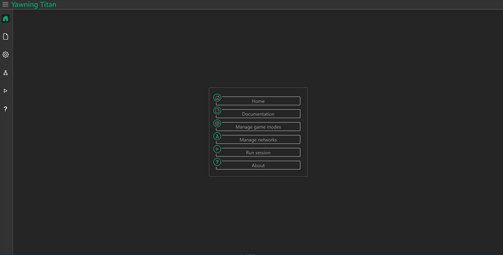

=================
Running a session
=================

Gettting started
################

To get started, Navigate to the run session (play icon) page from the sidebar or main menu

Running a YawningTitanRun session
#################################

The run session page is comprised of 6 sections that represent most configurable elements of the :class: `~yawning_titan.yawning_titan_run.YawningTitanRun`.
To launch a run instance navigate to the *Run session* button on the bottom right of the window

Network selection
*****************
The first section displays all networks which can be selected to be used within the run session

Game mode selection
*******************
The next section displays valid game modes compatible with the chosen network which can be selected to be used within the run session

Configurable inputs
*******************
The next section is comprised of 2 tabs which represent configurable elements for agent training and evaluation sessions

Metric display
**************
The next section is a live display of the metrics output by each loop of the currently running session

Log display
***********
The next section is a live display of the logs produced by :class: `~yawning_titan.yawning_titan_run.YawningTitanRun`
related to the Individual stages of the run session

Gif output
**********
The next section displays the gif output produced by each iteration of the trained agent playing the game
