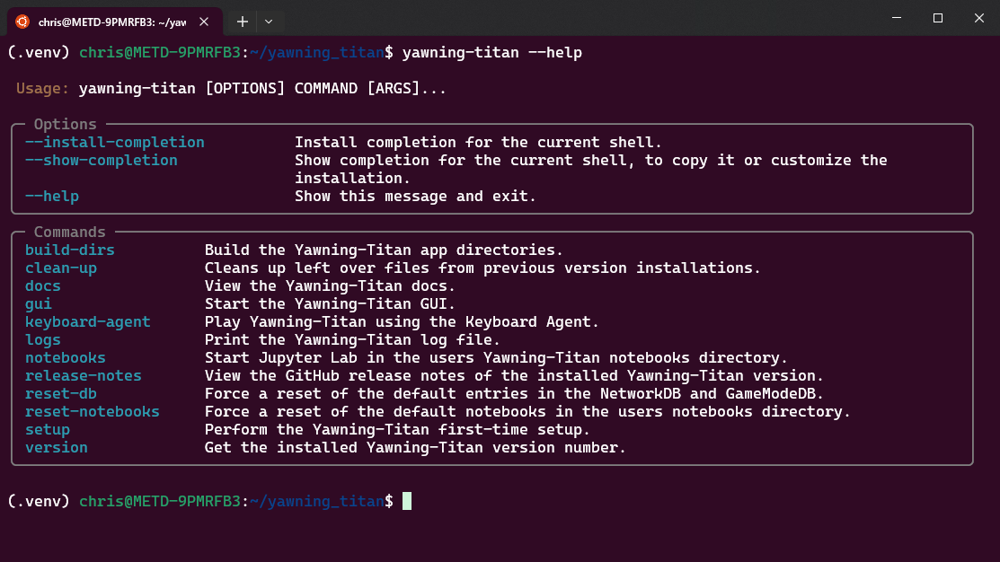
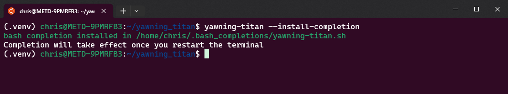

Command-Line Interface
======================

A command-line interface (CLI) built using `Typer <https://github.com/tiangolo/typer>`_ serves as the main entry-point
to Yawning-Titan once it is installed. To access the simply CLI, run the following command from the Python environment
that Yawning-Titan is installed on.

.. code:: bash

    yawning-titan --help

**Output:**

To make it easier to use the Yawning-Titan CLI, perform the completion installation.

.. code:: bash

    yawning-titan --install-completion

**Output:**

Now, when you hit the Tab key either before typing any option or while halfway through typing an option, the CLI will
display what matching options are available.

**Example:**

.. image:: ../_static/yt-cli-completion-example.png
   :width: 800
   :alt: Yawning-Titan CLI completion example
